# Play DOOM in Teletext :tv:

## doom-teletext

doom-teletext generates a teletext stream that contains rendering of the famous first-person shooter game DOOM from 1993. The generated data can be piped to applications that process teletext packet streams, either to send it to real TVs or to decode and display teletext pages on a computer.

**VIDEO PLACEHOLDER**

<!--
<a href="http://www.youtube.com/watch?feature=player_embedded&v=YOUTUBE_VIDEO_ID_HERE
" target="_blank"></a>
-->

**Tele...what?** Teletext is a standard for displaying (simple mosaic) graphics and text on TVs. The data to display is contained in the broadcast signal, hidden in the invisible vertical blanking interval area. Teletext was broadcasted for the first time  in 1974 and [still is](https://en.m.wikipedia.org/wiki/List_of_teletext_services) in many countries, mainly in Europe. A teletext page consists of 25 rows that can hold 40 characters each, while some characters are not displayable but hold information like text color of subsequent characters of the same line. If you want to learn more about this technology, the [Wikipedia page](https://en.wikipedia.org/wiki/Teletext) is a good starting point, for detailed technical documentation this [teletext specifications](https://www.etsi.org/deliver/etsi_i_ets/300700_300799/300706/01_60/ets_300706e01p.pdf) document is the way to go.

Since teletext is based on unidirectional data transmission, it is not possible to actually *run* DOOM in teletext. However, running the original game on some device that also generates a teletext page which holds the scene is just as fine. The packages sent by doom-teletext hold the teletext rendering of the current game frame, as well as a status bar that informs about the current state of the player. In detail, the status bar shows information like owned weapons, ammunition, health status, and a graphical representation of the player's face. Also the whole game menu was rebuilt for rendering in teletext.

There are different levels of teletext. Even though higher levels allow for higher resolution graphics and a larger color palette, this projects generates a stream of [level 1 teletext](https://en.wikipedia.org/wiki/World_System_Teletext#Levels), mainly because it just feels like 'real' teletext to me and I like the original blocky look.

## How to Play

To run DOOM on your machine, you will need a *WAD* file. If you don't own the game, the shareware version ([*doom1.wad*](https://doomwiki.org/wiki/DOOM1.WAD)) is freely available.

So far, I have tested this project only with doom1.wad, but *doom.wad* should be running fine as well. For other *WAD* files, especially those that have modified the look of the status bar or renamed levels or difficulty settings, adaptions in the code need do be done. (If you are interested in this, pull requests are welcome!)

doom-generic opens an SDL window which displays the original rendering of the game and processes key inputs. This means that the opened window has to keep focused in order to play the game. While the game is rendered in the SDL window, a teletext packet stream is sent to a target machine via a TCP connection. The receiver of the stream has to interpret the data by displaying it on a teletext viewer software or (for the best experience) send it to a real TV.

The keys for playing DOOM are shown on the '*Read This!*' pages, with the first one holding the teletext specific functionalities (increase/decrease FPS and change graphics mode) and the second one showing the keys for the actual gameplay.

Have fun!

## Rendering Constraints

Each teletext line can hold *40* characters. However, we cannot use all of them in graphics mode, as one character (displayed as *GW* in the screenshot) is required to switch to (contiguous) graphics mode. If the 'separated graphics' mode is preferred, another character (displayed as *SG* in the screenshot) is required. 

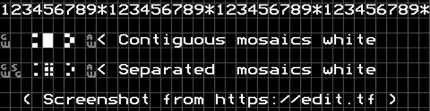

Characters in graphics mode can display sixels, which means that each cell is divided into *2\*3* regions, let's call them pixels, that can be empty or filled. 

Therefore, we have *39 \* 2 = 78* pixels in width for displaying graphics in contiguous mode, and *38 \* 2 = 76* pixels in width for separated graphics mode.

DOOM's original resolution is *320\*200* pixels, therefore it is not possible to show all of them on a teletext page, but *4\*4* pixels of DOOM have to be combined into a single teletext-pixel. To determine if the pixel in teletext is black or white, the brightness of the *16* DOOM pixels is considered.

Summarized, we can use *78 \* 4 = 312* pixels width of DOOM in contiguous graphics mode and *76 \* 4 = 304* pixels width of DOOM in separated graphics mode to consider for the rendering in teletext. The missing *8*, respectively *16*, pixels of width are cropped from the original rendering area on the left and right sides. 

While the original rendering is cropped on the left and right sides, we can show the whole height in *17* lines as *200 / 4 = 50* and *50 / 3 = 16,67*.

In total, the resolution of the rendering in teletext is *78 \* 50* in contiguous graphics mode and *76 \* 50* in separated graphics mode.

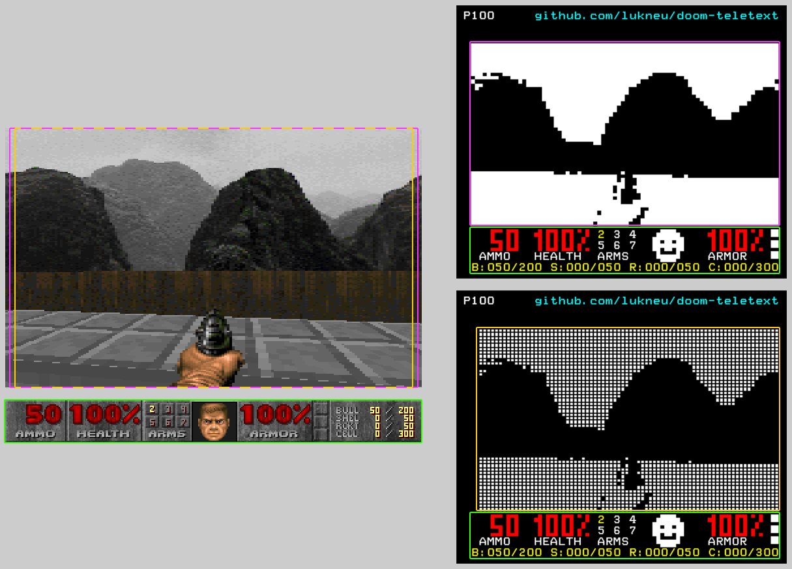

### Comparison of Original Rendering and Teletext Rendering

| Original Rendering                                                     | Teletext Rendering                                                         |
|------------------------------------------------------------------------|----------------------------------------------------------------------------|
| 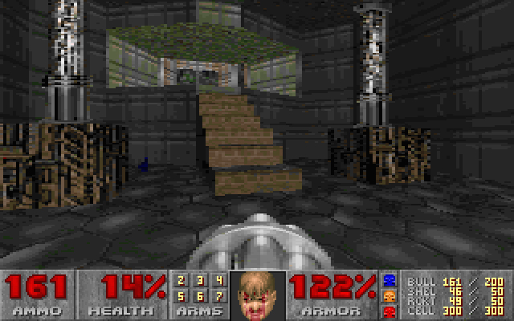 | 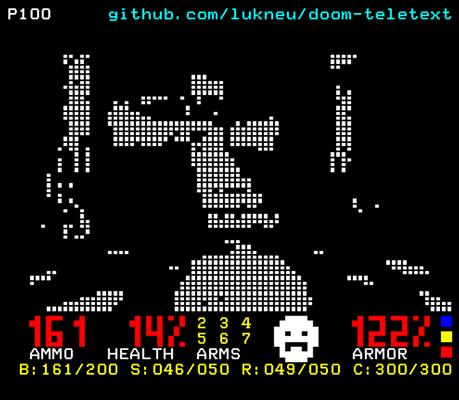  |
| 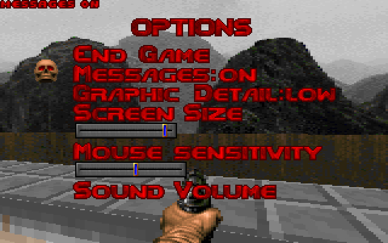           | 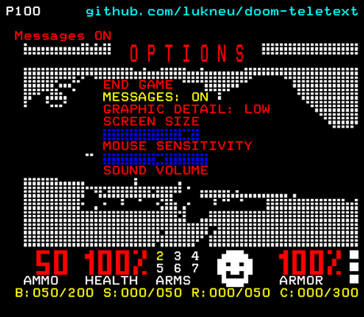            |
| 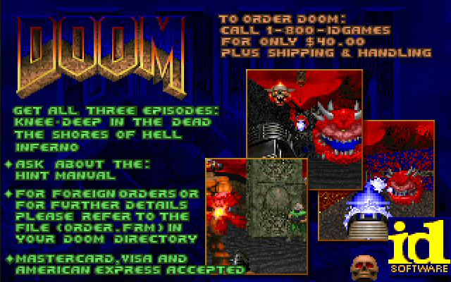  | 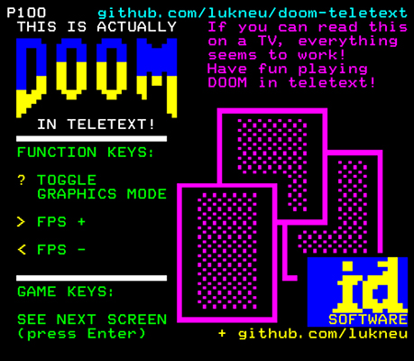   |
| 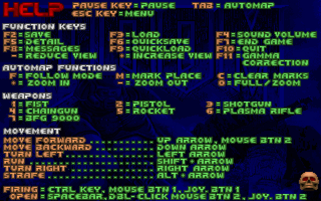  | 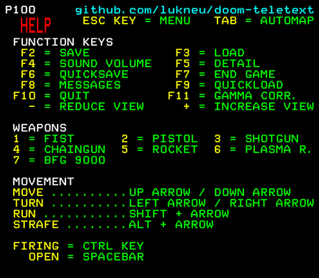   |
| 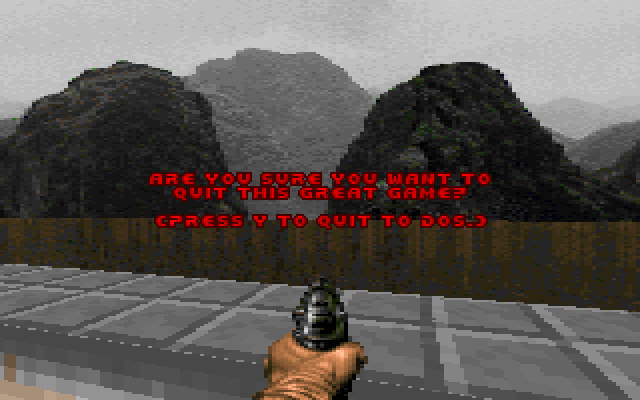   |     |

## How to Run

### Build

*(Disclaimer: The software is provided "AS IS", **without warranty of any kind**)*

I developed, built and executed this project on a Linux machine and therefore cannot say anything about other operating systems. However, as the window is created with the cross-platform library *Simple DirectMedia Layer*, there should not be that many obstacles when porting to another system.

Building this project should be fairly easy. A *Makefile* is provided in the *doom-teletext* subfolder, navigating into that folder and running `make` will do all the work and create an executable named *doom-generic*.

### Receive Data on Target Machine (Most Likely Raspberry Pi)

doom-generic uses TCP to send teletext packets, so the target machine has to open and listen to a specific port. This can be done, for example, by using *netcat*. Depending on if you want to display the teletext page 100 on a real TV or in a software, the content received via TCP has to be piped to different programs.

(Your Raspberry Pi might also be powerful enough to (build and) run the project, in this case there is no need for a second system that sends the teletext data via TCP connection, but you can run DOOM directly on the Raspberry Pi. However, I have not tested this. If you try this out, please let me know if it works, so that this README can be updated.)

#### Using a Real TV for Displaying Teletext

(Using a real TV for displaying the teletext page is great, but bear in mind that many modern TVs seem to struggle when updating teletext pages. My LG TV built in 2015 cannot run more than 3(!) FPS smoothly (and *losso3000* seems to have had a similar [experience](https://github.com/losso3000/420-years-of-teletext#modern-tvs-suck) in his great *420-years-of-teletext* project) while my FUNAI tube television handles more than 30 FPS like a champ.)

Ensure to have [composite out enabled](https://mlagerberg.gitbooks.io/raspberry-pi/content/3.5-analog-video-output.html) in Raspberry Pi settings and that you have successfully cloned, built and tested the demo of [raspi-teletext](https://github.com/ali1234/raspi-teletext).

Then run:

```sh
#Make your Raspberry listen to port 8080 and pipe input to teletext:
pi@raspberrypi:~/raspi-teletext$ sudo ./tvctl on
pi@raspberrypi:~/raspi-teletext$ netcat -l 8080 | ./teletext -
```
and start teletext page 100 by pressing the respective key on your remote control.

#### Using Software for Rendering Teletext Packets

If you don't have a suitable TV or Raspberry Pi available, you can also play DOOM in teletext by using a software like [vbit-iv](https://github.com/peterkvt80/vbit-iv):

Clone the repository and update the file *pft.config* so that page 100 is refreshed more often by using the following line as file content:

```100 5```

Then run:

```sh
#Make your target Linux device listen to port 8080 and pipe input to vbit-iv:
user@linux-target:~$ netcat -l 8080 | ~/Documents/vbit-iv/vbit-iv.py 1 00
```

### Send Data to Target Machine

Once the target machine has opened a TCP connection, run *doom-generic* on the host machine and send the output to the target machine:

```sh
#Assuming the target device has IP 192.168.0.42
#Navigate to the folder that holds the doom-teletext executable, then run:
user@linux-host:~$ ./doom-teletext -iwad PATH_TO_WAD_FILE -tt_stream_ip 192.168.0.42
```

You can change some settings by providing additional command line arguments:

#### Command Line Arguments

| Argument                   | Description                                                                                                   | Default Value                                                           |
|----------------------------|---------------------------------------------------------------------------------------------------------------|-------------------------------------------------------------------------|
| `-iwad PATH`               | *(Required)* Path to WAD file                                                                                 |                                                                         |
| `-tt_stream_ip VALUE`      | IP to send teletext packets to                                                                                | 127.0.0.1                                                               |
| `-tt_stream_port VALUE`    | PORT to send teletext packets to                                                                              | 8080                                                                    |
| `-tt_target_fps VALUE`     | Initial value [in range 1-35] for teletext page refreshes per second<br>(value can be adjusted while running) | 3<br>(because many modern TVs cannot handle high teletext refresh rate) |
| `-tt_skip_filling_headers` | Do not send header for page 1FF after each frame<br>(might allow for higher FPS value, depending on your TV)  |                                                                         |
| `-tt_permanent_debug_info` | Always display debug info (graphics mode & FPS) on teletext page                                              |                                                                         |
| `-tt_show_subtitle_intro`  | Shows starting message for 5 seconds in subtitle mode, before running the actual game                         |                                                                         |

#### Extra: Playing With Actual TV Remote 
FLIRC allows binding infrared commands to key presses, so you can record button pushes and use your remote control instead of a keyboard for key inputs, and therefore to play doom-teletext. 

## Related Projects

This project is based on the source of [doomgeneric](https://github.com/ozkl/doomgeneric), which makes porting DOOM quite easy. In detail, the SDL port was used as it already supports sound.

For playing around with teletext, the following projects and website, among others, turned out to be helpful for this project:

* [Teletext Charset](https://galax.xyz/TELETEXT/CHARSET.HTM) website gives a good overview of (special) teletext characters.
* [Teletext editor by zxnet](https://zxnet.co.uk/teletext/editor/) and [edit.tf](https://edit.tf) are great for playing around with teletext, especially for drawing sprites or whole pages and to export them to binary format.
* [420-years-of-teletext](https://github.com/losso3000/420-years-of-teletext) is another well documented project that updates a teletext page way more often than originally intended.
* [raspi-teletext](https://github.com/ali1234/raspi-teletext) lets you use a Raspberry Pi to show custom generated teletext on a real TV.

## Future Ideas

- [ ] Support for auto map
- [ ] Support for final screen of levels
- [ ] Support for other WAD files than doom1.wad
- [ ] Adding a rendering mode that uses colors instead of only black and white
- [ ] Adding a rendering mode that uses ASCII characters instead of mosaic mode
- [ ] Adding a completely new rendering mode that only draws edges